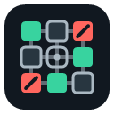

# OriginMatrix

<p align="center">
  
</p>

OriginMatrix 1.17.0 is a release-candidate implementation of a granular request firewall for Chromium-based browsers. Its matrix interface shows which domains a site contacts and lets users allow, block, or inherit policies by destination and resource type. Dynamic DNR generations are compared deterministically so unchanged rules are retained and no-op updates never call Chrome. Compiled network-filter generations are persisted by source checksum, feature configuration, compiler schema, and reserved DNR capacity, allowing service-worker restarts to skip unchanged network compilation. Runtime filtering prepares selector paths once, observes only required attributes, coalesces mutation roots, and schedules procedural work through a bounded idle callback. Page tools such as the element picker are injected only on demand. Diagnostics calculate hostname-specific scriptlet coverage from every enabled list and rank unsupported primitives by relevant and global demand. Evidence-selected scriptlets provide bounded constant assignment, text removal, and local-storage updates without arbitrary code or broad request interception. The request logger exposes the responsible EasyList, EasyPrivacy, custom, Matrix, or session rule. The automated release gate passes independently of the live cross-browser acceptance matrix; pending live results are documented rather than presented as verified compatibility.

OriginMatrix is an independent Manifest V3 project—not a port or visual copy of uMatrix. Logical policies are the source of truth and are compiled into Chrome `declarativeNetRequest` rules.

> A granular request firewall for the modern web.

## Current features

- Manifest V3 service worker with restart-safe state
- Bundled, automatically enabled static network protection
- Normalized network, exception, cosmetic, and scriptlet filter data models
- Network filter parser with explicit support and diagnostics reporting
- Budget-aware filter-to-DNR compiler with deterministic optimization
- Bundled EasyList network protection with dashboard diagnostics
- Bundled EasyPrivacy tracking protection, enabled by default
- Unified cross-list compilation with deterministic deduplication and shared rule budgeting
- Persistent bundled filter-list enable/disable management with complete rule counts
- Validated HTTPS filter-list updates with staged activation and rollback
- Site-aware EasyList cosmetic filtering for simple CSS selectors
- Batched dynamic cosmetic filtering with bounded DOM observation
- Bounded procedural `:has-text(...)` filtering for evidence-backed EasyList rules
- YouTube filter-coverage baseline with explicit compatibility diagnostics
- Combined EasyList/EasyPrivacy YouTube diagnostics with 98.1% relevant syntax coverage
- Generic `$generichide` exceptions for breakage-safe cosmetic filtering
- Site-specific relevant filter coverage by network, cosmetic, and scriptlet support
- Native relational cosmetic selectors and scoped hiding exceptions for modern sites
- Optimized global cosmetic filters with deduplicated, cached per-site selector plans
- Debounced SPA navigation lifecycle that re-evaluates cosmetics, scriptlets, diagnostics, and site state
- Selected domain-scoped scriptlet-filter parsing with allowlisted MAIN-world execution
- Deterministic EARLY and NORMAL scriptlet phases with per-document execution deduplication
- Data-driven scriptlet usage inventory that gates MAIN-world library expansion on active filter demand
- Matrix cells distinguish automatic filter decisions from user Allow/Block overrides
- Matrix columns for ALL, COOKIE, CSS, IMAGE, MEDIA, SCRIPT, XHR, FRAME, FONT, WEBSOCKET, and OTHER
- GLOBAL, site-wide, first-party, third-party, and observed-domain rows
- Explicit and inherited Allow/Block/Inheritance visualization
- Temporary tab rules backed by DNR session rules
- Commit and Revert workflow for persistent dynamic rules
- Deterministic policy resolution, priorities, and rule IDs
- Cookie request and response header removal
- Bounded per-tab request logs with lifecycle data and optional exact DNR attribution
- Privacy-preserving current-session request, block, domain, and cosmetic statistics
- Restart-safe Balanced, Strict, and Relaxed protection profiles
- Dashboard with diagnostics, rule inspection, import/export, debug reports, and request-log filters
- Versioned storage schemas and compensating rollback on failed rule updates
- Original scalable icon set for extension and toolbar surfaces
- Browser-independent unit tests for the policy, storage, compiler, workflow, and observation modules
- Opt-in Playwright acceptance tests for YouTube loading, playback, SPA navigation, page controls, diagnostics, and conservative ad-surface observations

Automatic protection combines the small static proof ruleset with pinned EasyList and EasyPrivacy snapshots. Their network, cosmetic, and selected domain-scoped `##+js(...)` rules are parsed locally as data, merged before compilation, and deduplicated into one shared generation; unsupported syntax is reported and never guessed. Global and site-specific native selectors are injected as one CSS batch. A separate bounded evaluator handles supported literal and safe-regexp `:has-text(...)` rules, including one nested descendant form, without sending native selectors through JavaScript. Batched DOM observation handles inserted elements and text changes without rescanning every mutation individually. Debounced native same-document navigation events re-evaluate the active cosmetic and scriptlet generations and reset top-frame session diagnostics without requiring a reload. Scriptlet names map exclusively to three bundled, argument-validated implementations. Balanced enables all engines without overriding automatic decisions, Strict adds targeted third-party Matrix blocks, and Relaxed disables scriptlets while retaining network and cosmetic protection. Updates are fetched only from catalogued HTTPS URLs, validated and compiled as inactive combined candidates, then swapped with rollback. Custom filter URLs, additional procedural operators, broader scriptlet syntax, uMatrix text-rule conversion, and Public-Suffix-List-based domain grouping are not currently included.

YouTube is tracked as a compatibility baseline, not as a guaranteed blocking claim. Generic native `:has()` filtering now covers promoted feed, Shorts, and ad-slot structures present in the pinned EasyList snapshot, while scoped `#@#` rules prevent incompatible hiding on excluded surfaces. The dashboard can analyze targeted bundled rules and report unsupported network, cosmetic, and scriptlet syntax. See [YouTube compatibility](docs/YOUTUBE-COMPATIBILITY.md) for verified scope and the manual acceptance checklist.

## Architecture

```text
Matrix / Dashboard
       ↓
Policy Engine and Store  ← source of truth
       ↓
Resolver → DNR Compiler → Rule IDs
       ↓
Unified Network Engine
  ├─ Static Rule Manager
  ├─ Dynamic Rule Manager
  ├─ Session Rule Manager
  └─ Rule Budget
       ↓
Chromium network stack

Network lifecycle → read-only Request Observer → Tab State → UI
```

UI modules send policy intent and never construct DNR rules. All direct `chrome.declarativeNetRequest` access is isolated in `src/network/`; the browser-independent matrix engine supplies validated rule generations through the unified Network Engine interface. Blocking and observation are deliberately separate systems.

See [Architecture](docs/ARCHITECTURE.md) for the policy model, resolution hierarchy, storage schema, compilation rules, observation flow, and MV3 design decisions.

## Documentation

- [Architecture](docs/ARCHITECTURE.md)
- [Security](docs/SECURITY.md)
- [Scriptlet coverage](docs/SCRIPTLET-COVERAGE.md)
- [Release-candidate checklist](docs/RELEASE-CANDIDATE.md)
- [YouTube compatibility](docs/YOUTUBE-COMPATIBILITY.md)
- [Third-party notices](docs/THIRD_PARTY_NOTICES.md)

## Local installation

1. Clone or download this repository.
2. Open the browser's extensions page (`chrome://extensions`, `edge://extensions`, `brave://extensions`, or `vivaldi://extensions`).
3. Enable **Developer mode**.
4. Select **Load unpacked** and choose the repository root.
5. Open an HTTP(S) page and reload it once so OriginMatrix can observe its requests.
6. Open the OriginMatrix toolbar popup.

OriginMatrix requires Chromium 121 or newer. This provides the independent session-rule quota and expanded safe dynamic-rule quota needed by the bundled filter generation.

After changing a matrix cell, reload the page when prompted. Use **Commit** to make the current tab/site changes persistent or **Revert** to discard them. The **Settings** button opens diagnostics, profiles, persistent rules, import/export, and request logs.

## Matrix interaction

The popup reports **Protection: ON · Network filters active** when the bundled `base-network` ruleset is enabled. Automatic filters provide the default result; any resolved Matrix Allow or Block decision has higher priority. Domain cells mark safely attributable automatic host decisions as `A+` or `A−`, while user rules retain `+` and `−`. Path-dependent filter rules continue to work in DNR but are not guessed from domain-only matrix data.

For normal resource cells, clicking cycles through:

```text
inherit → allow → block → inherit
```

Cookie cells intentionally cycle only between `inherit` and `block`. Manifest V3 cannot represent a cookie-only allow exception without risking an override of unrelated request-blocking rules.

Dark green/red cells are explicit rules; lighter colors are inherited effective results. A highlighted neutral cell represents a temporary `inherit` edit that will remove its persistent cell when committed.

## Development and tests

The project uses HTML, CSS, vanilla JavaScript, ES modules, and Chrome Extension APIs without runtime dependencies or a build step.

Run the browser-independent tests with a current Node.js release:

```sh
npm test
```

The Playwright suite is a development-only dependency and requires an explicitly enabled live run:

```sh
ORIGINMATRIX_YOUTUBE_LIVE=1 npm run test:browser:youtube
```

See [YouTube compatibility](docs/YOUTUBE-COMPATIBILITY.md) for PowerShell usage, browser-channel configuration, observation semantics, and current limitations.

Network blocking and extension lifecycle behavior still require integration testing in Chrome, Edge, Brave, Vivaldi, or another compatible Chromium browser.

For the full automated release gate, packaging command, Chrome/Edge/Brave/Vivaldi matrix, site scenarios, and evidence requirements, see [Release candidate](docs/RELEASE-CANDIDATE.md).

The PNG icons can be regenerated from the shared vector geometry on Windows:

```powershell
./tools/generate-icons.ps1
```

## Policy import and export

OriginMatrix exports versioned JSON:

```json
{
  "format": "originmatrix",
  "version": 1,
  "policies": []
}
```

Imports support validated merge and replace modes. Unsupported formats and uMatrix text rules are rejected explicitly rather than partially converted.

## Manifest V3 limitations

- Blocking is declarative; JavaScript does not synchronously intercept requests.
- Rule changes affect future requests, so previously loaded resources require a reload.
- Session rules survive service-worker suspension but are cleared with the browser session.
- Requests served from Chromium's in-memory cache may be invisible to `webRequest`.
- Request failures are not labeled as blocked because Chrome does not provide stable production error classification for every case.
- Exact DNR rule attribution uses Chrome's debug-feedback API, which is available only to unpacked extensions; packaged builds retain requests with an explicit `unknown` decision.
- First-party UI grouping currently uses hostname ancestry rather than registrable-domain/eTLD+1 classification.
- On Chrome versions without top-level-domain DNR conditions, requests initiated inside cross-origin subframes may not match a top-level-site policy.
- Request logs retain at most 250 entries per tab in session storage. They may contain full URLs but are never transmitted by OriginMatrix.
- Statistics aggregate only currently tracked tab state in session storage; closing a tab removes its contribution, and no permanent browsing history is built.
- Performance diagnostics expose measured startup, rule, parsing, cache, content-script, and batched MutationObserver data. Memory, YouTube playback, and comparative page-load impact remain explicit browser-profiling tasks rather than inferred values.
- The conservative optimizer removes only semantically identical rules.

## Security and privacy

- No remote code, `eval`, analytics, telemetry, or external assets
- No synchronous `webRequestBlocking`
- Policies are validated before compilation
- Failed generation changes use compensating rollback
- Request observation cannot modify network requests
- Logical policies—not generated DNR rules—remain authoritative

The reviewed trust boundaries, resource limits, and permission rationale are documented in [Security](docs/SECURITY.md).

## Roadmap

- Local Public Suffix List integration
- Browser-driven memory, YouTube playback, and comparative page-load benchmarks
- Explicit uMatrix compatibility reports and import adapter
- Production browser integration tests
- Further rule optimization where semantic equivalence can be proven

## Release status

Version 1.17.0 is prepared as a release candidate. Repository tests and static release validation are automated; browser and live-site rows remain explicitly unverified until recorded with evidence in the [release-candidate checklist](docs/RELEASE-CANDIDATE.md).

## License

OriginMatrix is available under the [MIT License](LICENSE.md).

The bundled EasyList and EasyPrivacy snapshots are separately licensed by their upstream authors. See [Third-party notices](docs/THIRD_PARTY_NOTICES.md).
